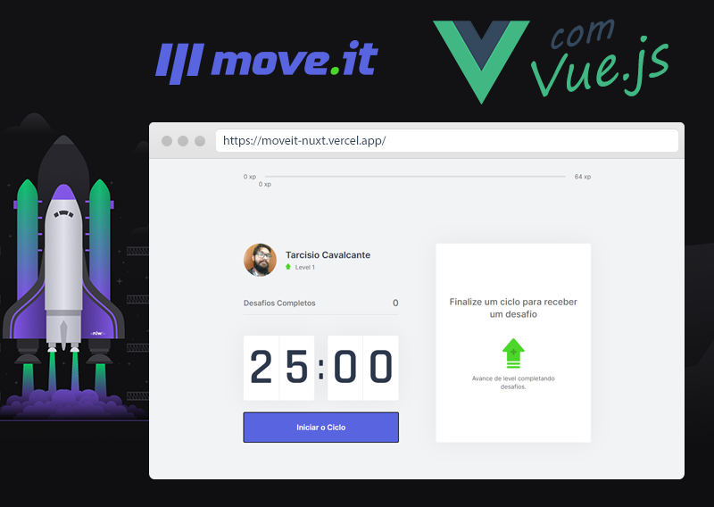

<p align="center">
  
<p>

<p align="center">
  
  
  

  

  
  </p>

<h2 align="center">
<a href="https://moveit-nuxt.vercel.app/">https://moveit-nuxt.vercel.app/</a>
</h2>

# Moveit com Vue.js

Na Next Level Week #4 - trilha React, da Rocketseat, foi criado o Moveit. Um app que une a técnica de Pomodoro com a realização de exercícios físicos para quem passa muito tempo na frente do computador.

O projeto da Rocketseat focou em Ract e Next. Eu fiz o projeto original (repositório aqui: https://github.com/personalnerd/nlw4-moveit-next), mas logo após eu fiz esta versão "convertida" para Vue.js.

## Tecnologias

Esse projeto foi desenvolvido com as seguintes tecnologias:

- [Vue.js](https://vuejs.org/)
- [Nuxt.js](https://nuxtjs.org/)
- [SASS](https://sass-lang.com/)

## Layout

Você pode visualizar o layout do projeto através [desse link](https://www.figma.com/file/ge20pu3ofMOKoliUyKx1Nl/Move.it-1.0). É necessário ter conta no [Figma](http://figma.com/) para acessá-lo.

## Como executar

```bash
# clone o repositório

# instale as dependências
$ yarn install

# inicie o servidor (localhost:3000)
$ yarn dev
```
